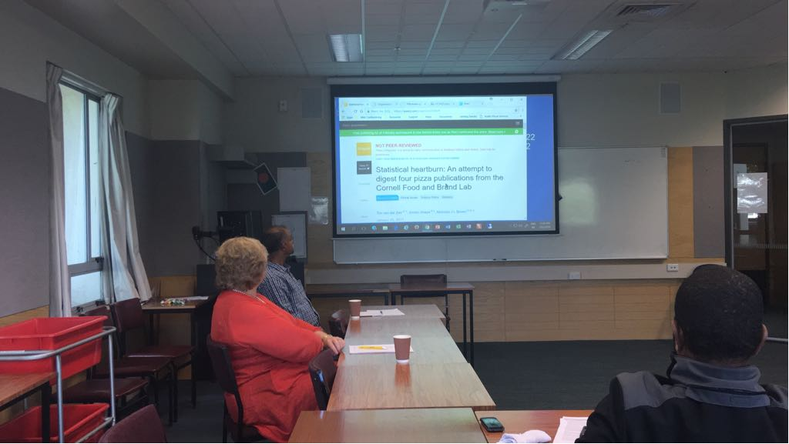

Organisation of the preprint journal club
==============================================
[Link to the Third Preprint Journal Club, 27th March, Tuesday, 10-11 AM, Waimairi Staff Room](https://arinbasu.github.io/UC-SHSS-Study-Group/2018-03-27-third)

[Link to the Second Journal Club, 13th March, Tuesday, 10-11 AM, Jack Mann Auditorium](https://arinbasu.github.io/UC-SHSS-Study-Group/2018-03-08-second-club)

7th February, 2017, Wheki 101, Wednesday, 10:30 AM - 11:30 AM ((Inaugural session)
-------------------

As this is the first session, we will host it in Wheki 101. In addition to discussing the topic, we will also discuss about the future of this journal club and your preferred location, timing, and frequency. We will discuss the following article:

*van der Zee T, Anaya J, Brown NJL. (2017) Statistical heartburn: An attempt to digest four pizza publications from the Cornell Food and Brand Lab. PeerJ Preprints 5:e2748v1 https://doi.org/10.7287/peerj.preprints.2748v1*

Download link: [https://peerj.com/preprints/2748/#](https://peerj.com/preprints/2748/#)

Summary of this paper
----------------------
In this paper, the authors reanalysed four articles from a research paper on data collected from diners at an Italian restaurant buffet. They found several inconsistencies in the paper and pointed them out. I selected this as the first paper to make it a fun reading but also to alert to our readers the need to be alert and vigilant about facts when you read a paper. Let's see how we dissect this paper in our club.

In the first journal club (7th Feb, 2018) we discussed the van der Zee (2017) paper where they dissected four other papers for the statistical inconsistencies. The discussants thought that the paper was heavy on the statistical details but they also needed to focus on translation of the meaning of the details for a relatively statistics-aversive readership to translate the meanings. Some of us also thought that it'd be a good idea if the readers themselves were more open to statistics. We discussed the role of & need for replicable and reproducible research in different contexts of our work. 

Write your own review or contribute
-------------------------------------
Use the  link to write your review of the paper after the discussion: 
1. Create a free account on [Authorea](http://www.authorea.com)
2. [Click on this link to write the preprint review](https://www.authorea.com/users/2191/articles/217328-ucshss-preprint-review-an-attempt-to-digest-four-pizza-publications)
3. First add your username to the list of authors on the top of the document
4. Then write your answers to the questions posted on the authorea document. Use Authorea's editor to write your responses. Do this withing three days of the journal club. Write as much or as little as you want. Do not write anything before we host the journal club, only _after_ the journal club.

Within three days of our discussion, we will collate the responses and we will write a letter to the authors of the preprint about our impressions based on the journal club. We will also be able to use this review to gain a publication point (this is referred to as minting DOI for leaving a permanent scholarly record).

Suggest a paper
----------------
[Please click me to suggest a paper for the journal club:](https://goo.gl/forms/yT1SL91yTbwe6SWk2)

